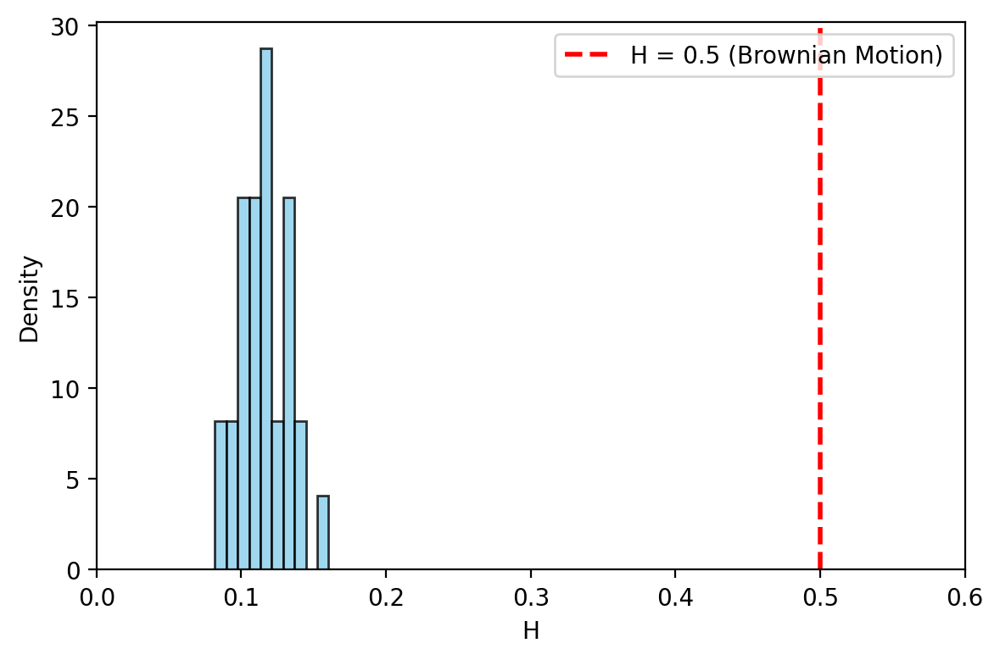
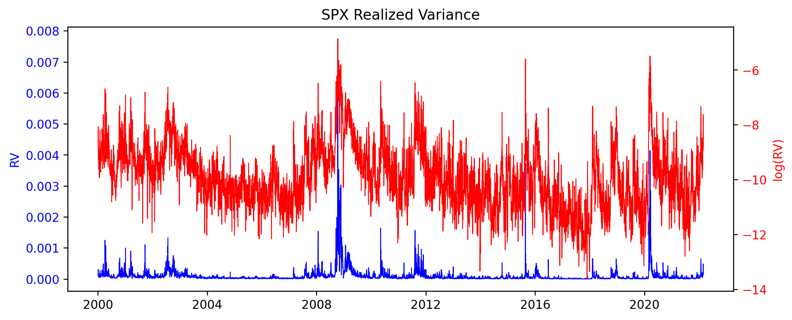
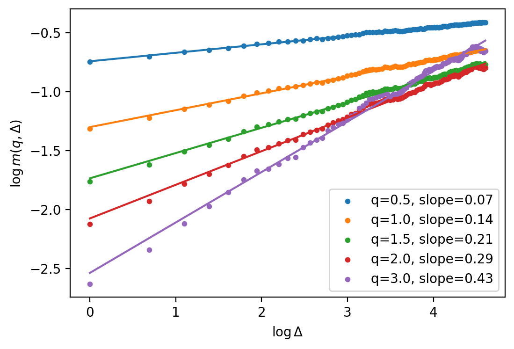
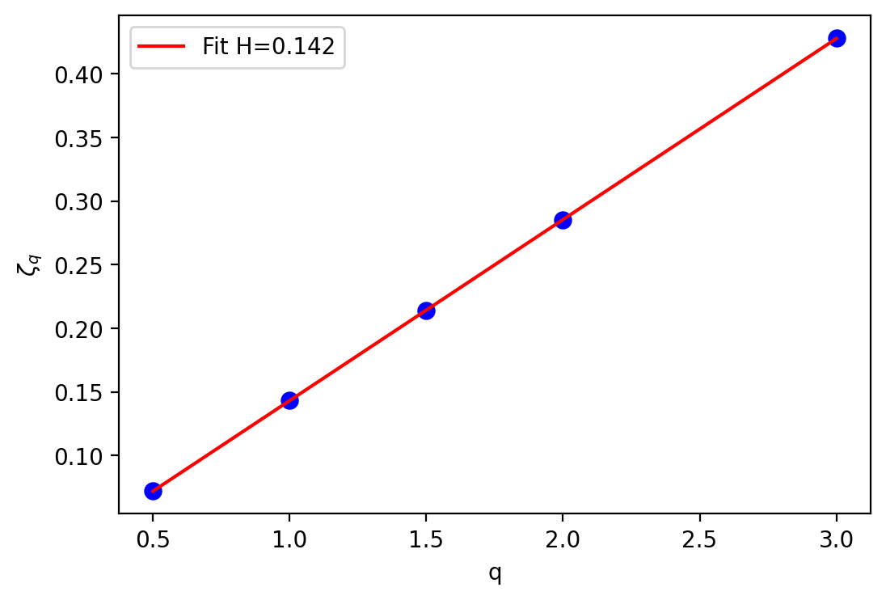
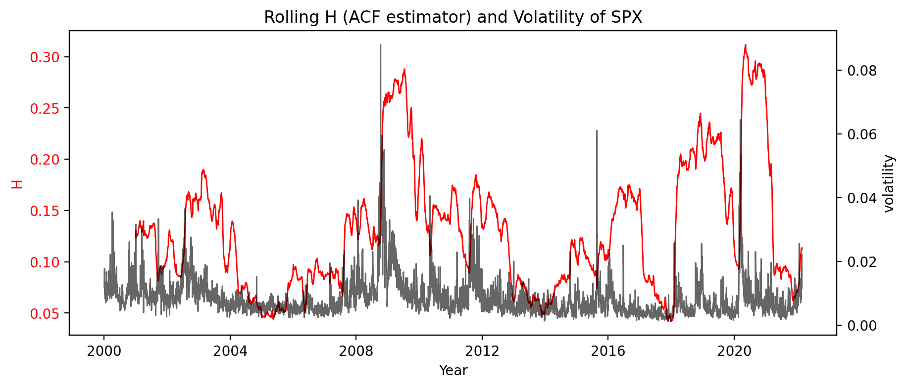

# Volatility is Rough

An empirical replication of the foundational rough-volatility paper, using high-frequency realized-volatility data for the S&P 500 and ~30 other global equity indices.

> **Reference:** Gatheral, J., Jaisson, T. & Rosenbaum, M. (2018). *Volatility is Rough.* [arXiv:1410.3394](https://arxiv.org/pdf/1410.3394)

---

## Overview

Classical stochastic-volatility models (Heston, SABR, etc.) assume volatility is driven by a standard Brownian motion, which corresponds to a **Hurst exponent of H = 0.5**. The "rough volatility" literature shows this is empirically wrong: log-volatility behaves like a fractional Brownian motion with a Hurst exponent of roughly **H ≈ 0.1**, meaning volatility paths are far *rougher* (more jagged, with stronger short-term mean reversion) than a Brownian motion.

This project reproduces that result from scratch:

1. Estimates the Hurst exponent of realized volatility via the **scaling of moments** of log-volatility increments.
2. Cross-checks it with an independent **autocorrelation-based** estimator.
3. Contrasts the classical **FSV** model against the **Rough FSV (RFSV)** model.
4. Builds an **RFSV volatility forecaster** and benchmarks it against standard **AR** and **HAR** models.

## Key result

Across all indices, the estimated Hurst exponent clusters tightly around **0.1–0.16** — nowhere near the 0.5 implied by Brownian motion. Volatility is rough.

*Estimated H for ~30 global indices. Every index sits far to the left of the H = 0.5 Brownian-motion benchmark (dashed red).*

## Methodology & results

### 1. Realized volatility and moment scaling

Starting from 5-minute realized variance, the analysis measures the q-th sample moment of log-volatility increments at lag Δ:

$$m(q,\Delta) = \langle\, |\log\sigma_{t+\Delta} - \log\sigma_t|^{q} \,\rangle$$

Plotting $\log m(q,\Delta)$ against $\log \Delta$ gives straight lines for every $q$ — the signature of **monofractal scaling**, where the slope is $\zeta_q$:

$$\log m(q,\Delta) = \zeta_q \log \Delta + C_q$$

| SPX realized variance | Moment scaling |
| --- | --- |
|  |  |

### 2. Recovering the Hurst exponent

The scaling exponents satisfy $\zeta_q = qH$, so a linear fit of $\zeta_q$ versus $q$ yields the Hurst exponent directly — here $H \approx 0.14$ for the SPX.

### 3. ACF estimator & time-variation of H

An independent estimator based on the fractional-Brownian-motion covariance structure confirms the result, and a rolling-window version shows how H drifts over time alongside the volatility level (notably during the 2008 and 2020 crises).

### 4. Forecasting

The final notebooks implement the RFSV continuous-time predictor and compare its out-of-sample forecasting accuracy against AR and HAR benchmarks, scored with the **P-ratio** (forecast MSE relative to the unconditional-mean predictor).

## Repository structure

| Notebook | Contents |
| --- | --- |
| `1_rough_H.ipynb` | Load data, plot realized vol, moment-scaling analysis, Hurst exponent for all indices |
| `2_acf_H.ipynb` | ACF-based Hurst estimator (fBm covariance) + rolling H over time |
| `3_FSV_vs_RFSV_model.ipynb` | Fractional Stochastic Volatility vs Rough FSV model comparison |
| `4_RFSV_forecast.ipynb` | RFSV continuous-time volatility forecasting |
| `5_forecast_compare.ipynb` | RFSV vs AR vs HAR forecast comparison (P-ratio) |
| `data/` | Oxford-Man Realized Library CSV |
| `figures/` | Generated plots |

## Data

[Oxford-Man Institute Realized Library](https://oxford-man.ox.ac.uk/) — daily realized-volatility measures (5-minute realized variance, realized kernels, bipower variation, etc.) for ~30 global equity indices, from 2000 onward.

## Tech stack

`Python` · `NumPy` · `pandas` · `SciPy` · `scikit-learn` · `Matplotlib`

## References

- Gatheral, J., Jaisson, T. & Rosenbaum, M. (2018). *Volatility is Rough.* [arXiv:1410.3394](https://arxiv.org/pdf/1410.3394)
- [Rough volatility — Wikipedia](https://en.wikipedia.org/wiki/Rough_volatility)
- [Hurst exponent — Wikipedia](https://en.wikipedia.org/wiki/Hurst_exponent)
- [Fractional Brownian motion — Wikipedia](https://en.wikipedia.org/wiki/Fractional_Brownian_motion)